---
## Front matter
title: "Отчет по лабораторной работе №2"
subtitle: "Дисциплина: Операционные системы"
author: "Кирьянова Екатерина Андреевна"

## Generic otions
lang: ru-RU
toc-title: "Содержание"

## Bibliography
bibliography: bib/cite.bib
csl: pandoc/csl/gost-r-7-0-5-2008-numeric.csl

## Pdf output format
toc: true # Table of contents
toc-depth: 2
lof: true # List of figures
fontsize: 12pt
linestretch: 1.5
papersize: a4
documentclass: scrreprt
## I18n polyglossia
polyglossia-lang:
  name: russian
  options:
	- spelling=modern
	- babelshorthands=true
polyglossia-otherlangs:
  name: english
## I18n babel
babel-lang: russian
babel-otherlangs: english
## Fonts
mainfont: IBM Plex Serif
romanfont: IBM Plex Serif
sansfont: IBM Plex Sans
monofont: IBM Plex Mono
mathfont: STIX Two Math
mainfontoptions: Ligatures=Common,Ligatures=TeX,Scale=0.94
romanfontoptions: Ligatures=Common,Ligatures=TeX,Scale=0.94
sansfontoptions: Ligatures=Common,Ligatures=TeX,Scale=MatchLowercase,Scale=0.94
monofontoptions: Scale=MatchLowercase,Scale=0.94,FakeStretch=0.9
mathfontoptions:
## Biblatex
biblatex: true
biblio-style: "gost-numeric"
biblatexoptions:
  - parentracker=true
  - backend=biber
  - hyperref=auto
  - language=auto
  - autolang=other*
  - citestyle=gost-numeric
## Pandoc-crossref LaTeX customization
figureTitle: "Рис."
tableTitle: "Таблица"
listingTitle: "Листинг"
lofTitle: "Список иллюстраций"
lolTitle: "Листинги"
## Misc options
indent: true
header-includes:
  - \usepackage{indentfirst}
  - \usepackage{float} # keep figures where there are in the text
  - \floatplacement{figure}{H} # keep figures where there are in the text
---

# Цель работы

Изучить идеологию и применение средств контроля версий и освоить умения по работе с git.

# Задание

1. Установка программного обеспечения 
2. Базовая настройка git
3. Создание ключей ssh
4. Создание ключей gpg
5. Добавление PGP ключа в GitHub
6. Настройка автоматических подписей коммитов git
7. Настройка gh
8. Шаблон для рабочего пространства

# Теоретическое введение

Системы контроля версий. Общие понятия

Системы контроля версий (Version Control System, VCS) применяются при работе нескольких человек над одним проектом. Обычно основное дерево проекта хранится в локальном или удалённом репозитории, к которому настроен доступ для участников проекта. При внесении изменений в содержание проекта система контроля версий позволяет их фиксировать, совмещать изменения, произведённые разными участниками проекта, производить откат к любой более ранней версии проекта, если это требуется.

В классических системах контроля версий используется централизованная модель, предполагающая наличие единого репозитория для хранения файлов. Выполнение большинства функций по управлению версиями осуществляется специальным сервером. Участник проекта (пользователь) перед началом работы посредством определённых команд получает нужную ему версию файлов. После внесения изменений, пользователь размещает новую версию в хранилище. При этом предыдущие версии не удаляются из центрального хранилища и к ним можно вернуться в любой момент. Сервер может сохранять не полную версию изменённых файлов, а производить так называемую дельта-компрессию — сохранять только изменения между последовательными версиями, что позволяет уменьшить объём хранимых данных.

Системы контроля версий поддерживают возможность отслеживания и разрешения конфликтов, которые могут возникнуть при работе нескольких человек над одним файлом. Можно объединить (слить) изменения, сделанные разными участниками (автоматически или вручную), вручную выбрать нужную версию, отменить изменения вовсе или заблокировать файлы для изменения. В зависимости от настроек блокировка не позволяет другим пользователям получить рабочую копию или препятствует изменению рабочей копии файла средствами файловой системы ОС, обеспечивая таким образом, привилегированный доступ только одному пользователю, работающему с файлом.

Системы контроля версий также могут обеспечивать дополнительные, более гибкие функциональные возможности. Например, они могут поддерживать работу с несколькими версиями одного файла, сохраняя общую историю изменений до точки ветвления версий и собственные истории изменений каждой ветви. Кроме того, обычно доступна информация о том, кто из участников, когда и какие изменения вносил. Обычно такого рода информация хранится в журнале изменений, доступ к которому можно ограничить.

В отличие от классических, в распределённых системах контроля версий центральный репозиторий не является обязательным.

Среди классических VCS наиболее известны CVS, Subversion, а среди распределённых — Git, Bazaar, Mercurial. Принципы их работы схожи, отличаются они в основном синтаксисом используемых в работе команд.

# Выполнение лабораторной работы

## Установка программного обеспечения

Устанавливаю git (рис. [-@fig:001]).

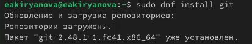{#fig:001 width=70%}

Устанавливаю gh (рис. [-@fig:002]).

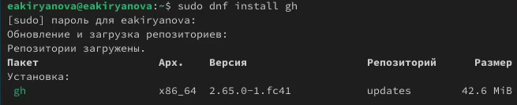{#fig:002 width=70%}

## Базовая настройка git

Задаю свои имя и email (рис. [-@fig:003]).

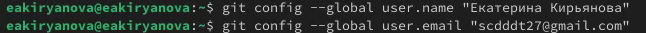{#fig:003 width=70%}

Настраиваю utf-8 в выdоде сообщений git (рис. [-@fig:004]).

{#fig:004 width=70%}

Задаю параметры autocrlf и safecrlf (рис. [-@fig:005]).

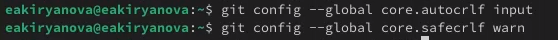{#fig:005 width=70%}

## Создание ключей ssh

Создаю ssh ключ по алгоритму rsa с размером 4096 бит (рис. [-@fig:006]).

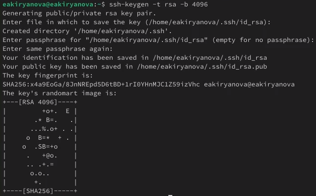{#fig:006 width=70%}

Теперь по алгоритму ed25519 (рис. [-@fig:007]).

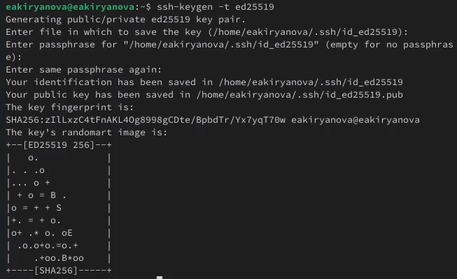{#fig:007 width=70%}

## Создание ключей pgp

Генерирую ключ (рис. [-@fig:008]).

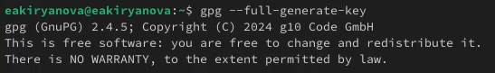{#fig:008 width=70%}

## Добавление PGP ключа в GitHub

Вывожу список ключей (рис. [-@fig:009]).

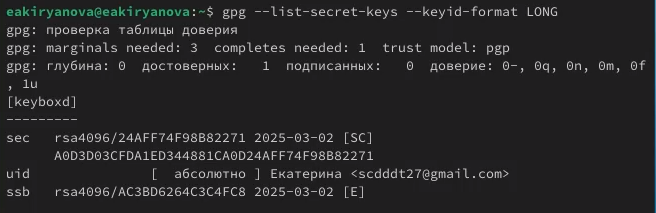{#fig:009 width=70%}

Генерирую ключ (рис. [-@fig:010]).

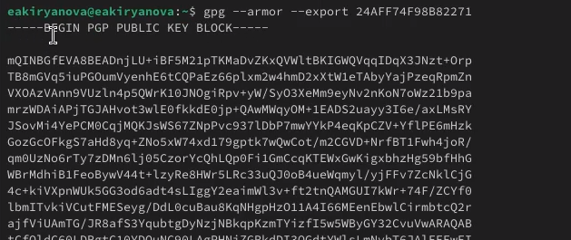{#fig:010 width=70%}

Создаю новый GPG ключ на GitHub (рис. [-@fig:011]).

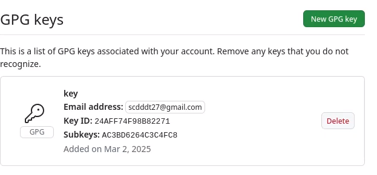{#fig:011 width=70%}

## Настройка автоматических подписей коммитов git 

Указываю Git применять введенный email при подписи коммитов (рис. [-@fig:012]).

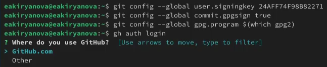{#fig:012 width=70%}

## Настройка gh

Авторизуюсь с помощью gh auth login (рис. [-@fig:013]).

{#fig:013 width=70%}

## Шаблон для рабочего пространства

Создаю репозиторий (рис. [-@fig:014]).

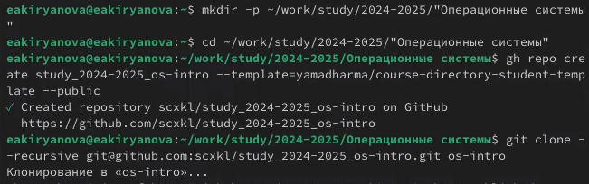{#fig:014 width=70%}

Перехожу в каталог курса (рис. [-@fig:015]).

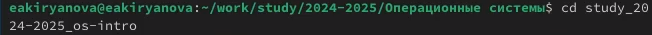{#fig:015 width=70%}

Удаляю лишние файлы (рис. [-@fig:016]).

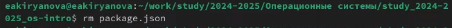{#fig:016 width=70%}

Создаю необходимые каталоги (рис. [-@fig:017]).

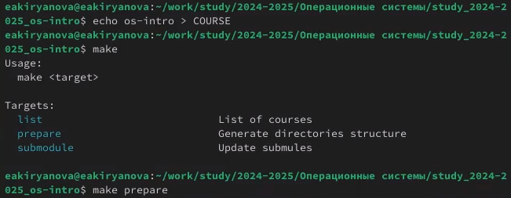{#fig:017 width=70%}

Отправляю файлы на сервер (рис. [-@fig:018]).

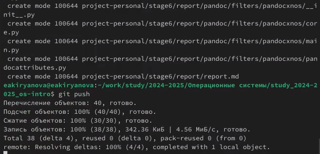{#fig:018 width=70%}

# Выводы

В ходе выполнения данной лабораторной работы я изучила идеологию и применение средств контроля версий и освоила умения по работе с git.

# Список литературы{.unnumbered}

1.[Лабораторная работа №2](https://esystem.rudn.ru/mod/page/view.php?id=1224230)
