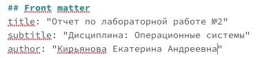
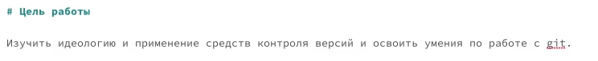
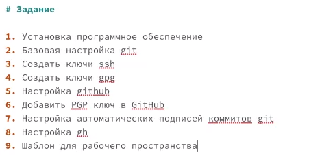
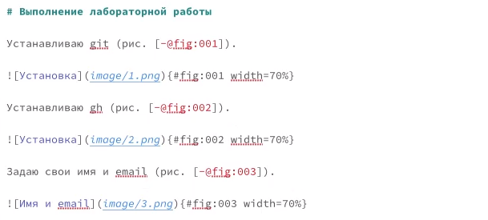
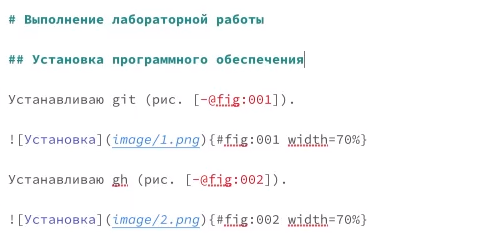
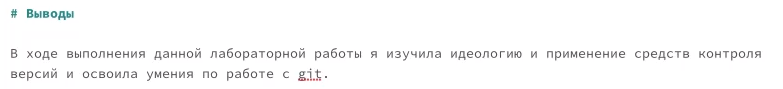
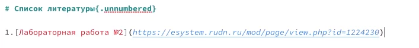
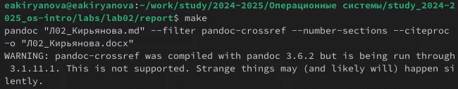
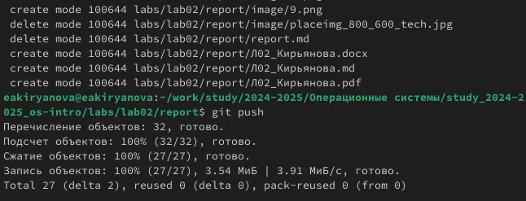

---
## Front matter
title: "Отчет по лабораторной работе №3"
subtitle: "Дисциплина: Операционные системы"
author: "Кирьянова Екатерина Андреевна"

## Generic otions
lang: ru-RU
toc-title: "Содержание"

## Bibliography
bibliography: bib/cite.bib
csl: pandoc/csl/gost-r-7-0-5-2008-numeric.csl

## Pdf output format
toc: true # Table of contents
toc-depth: 2
lof: true # List of figures
fontsize: 12pt
linestretch: 1.5
papersize: a4
documentclass: scrreprt
## I18n polyglossia
polyglossia-lang:
  name: russian
  options:
	- spelling=modern
	- babelshorthands=true
polyglossia-otherlangs:
  name: english
## I18n babel
babel-lang: russian
babel-otherlangs: english
## Fonts
mainfont: IBM Plex Serif
romanfont: IBM Plex Serif
sansfont: IBM Plex Sans
monofont: IBM Plex Mono
mathfont: STIX Two Math
mainfontoptions: Ligatures=Common,Ligatures=TeX,Scale=0.94
romanfontoptions: Ligatures=Common,Ligatures=TeX,Scale=0.94
sansfontoptions: Ligatures=Common,Ligatures=TeX,Scale=MatchLowercase,Scale=0.94
monofontoptions: Scale=MatchLowercase,Scale=0.94,FakeStretch=0.9
mathfontoptions:
## Biblatex
biblatex: true
biblio-style: "gost-numeric"
biblatexoptions:
  - parentracker=true
  - backend=biber
  - hyperref=auto
  - language=auto
  - autolang=other*
  - citestyle=gost-numeric
## Pandoc-crossref LaTeX customization
figureTitle: "Рис."
tableTitle: "Таблица"
listingTitle: "Листинг"
lofTitle: "Список иллюстраций"
lolTitle: "Листинги"
## Misc options
indent: true
header-includes:
  - \usepackage{indentfirst}
  - \usepackage{float} # keep figures where there are in the text
  - \floatplacement{figure}{H} # keep figures where there are in the text
---

# Цель работы

Научиться оформлять отчеты с помощью легковесного языка разметки Markdown

# Задание

Сделать отчет по предыдущей лабораторной работе в формате Markdown

# Теоретическое введение

Markdown — это простой язык разметки, используемый для создания форматированного текста (например, HTML) с помощью текстового редактора. Он позволяет добавлять к тексту базовое форматирование, используя символы, известные и доступные на всех клавиатурах. Размер шрифта, цвет и другие расширенные параметры недоступны в Markdown.

# Выполнение лабораторной работы

Оформляю титульный лист для отчета по лабораторной работе №2 (рис. [-@fig:001]).

{#fig:001 width=70%}

Записываю цель работы (рис. [-@fig:002]).

{#fig:002 width=70%}

Описываю задание (рис. [-@fig:003]).

{#fig:003 width=70%}

Пишу процесс выполнения лабораторной работы, подкрепляя все действия скриншотами (рис. [-@fig:004]).

{#fig:004 width=70%}

Добавляю заголовки (рис. [-@fig:005]).

{#fig:005 width=70%}

Делаю вывод (рис. [-@fig:006]).

{#fig:006 width=70%}

Заполняю теоретическое введение и оформляю список литературы (рис. [-@fig:007]).

{#fig:007 width=70%}

Компилирую файл с отчетом по лабораторной работе (рис. [-@fig:008]).

{#fig:008 width=70%}

Отправляю изменения на GitHub и сохраняю (рис. [-@fig:009]).

{#fig:009 width=70%}
# Выводы

В ходе выполнения данной лабораторной работы я научилась оформлять отчеты с помощью легковесного языка разметки Markdown

# Список литературы{.unnumbered}

1.[Vivaldi](https://help.vivaldi.com/ru/services-ru/forum-ru/markdown-formatting/)
