---
## Front matter
title: "Отчет по лабораторной работе №4"
subtitle: "Дисциплина: Операционные системы"
author: "Кирьянова Екатерина Андреевна"

## Generic otions
lang: ru-RU
toc-title: "Содержание"

## Bibliography
bibliography: bib/cite.bib
csl: pandoc/csl/gost-r-7-0-5-2008-numeric.csl

## Pdf output format
toc: true # Table of contents
toc-depth: 2
lof: true # List of figures
fontsize: 12pt
linestretch: 1.5
papersize: a4
documentclass: scrreprt
## I18n polyglossia
polyglossia-lang:
  name: russian
  options:
	- spelling=modern
	- babelshorthands=true
polyglossia-otherlangs:
  name: english
## I18n babel
babel-lang: russian
babel-otherlangs: english
## Fonts
mainfont: IBM Plex Serif
romanfont: IBM Plex Serif
sansfont: IBM Plex Sans
monofont: IBM Plex Mono
mathfont: STIX Two Math
mainfontoptions: Ligatures=Common,Ligatures=TeX,Scale=0.94
romanfontoptions: Ligatures=Common,Ligatures=TeX,Scale=0.94
sansfontoptions: Ligatures=Common,Ligatures=TeX,Scale=MatchLowercase,Scale=0.94
monofontoptions: Scale=MatchLowercase,Scale=0.94,FakeStretch=0.9
mathfontoptions:
## Biblatex
biblatex: true
biblio-style: "gost-numeric"
biblatexoptions:
  - parentracker=true
  - backend=biber
  - hyperref=auto
  - language=auto
  - autolang=other*
  - citestyle=gost-numeric
## Pandoc-crossref LaTeX customization
figureTitle: "Рис."
tableTitle: "Таблица"
listingTitle: "Листинг"
lofTitle: "Список иллюстраций"
lolTitle: "Листинги"
## Misc options
indent: true
header-includes:
  - \usepackage{indentfirst}
  - \usepackage{float} # keep figures where there are in the text
  - \floatplacement{figure}{H} # keep figures where there are in the text
---

# Цель работы

Получение навыков правильной работы с репозиториями git

# Задание

1. Выполнить работу для тестового репозитория
2. Преобразовать рабочий репозиторий в репозиторий с git-flow и conventional commits

# Теоретическое введение

Gitflow Workflow опубликована и популяризована Винсентом Дриссеном.
Gitflow Workflow предполагает выстраивание строгой модели ветвления с учётом выпуска проекта.
Данная модель отлично подходит для организации рабочего процесса на основе релизов.
Работа по модели Gitflow включает создание отдельной ветки для исправлений ошибок в рабочей среде.
Последовательность действий при работе по модели Gitflow:
        Из ветки master создаётся ветка develop.
        Из ветки develop создаётся ветка release.
        Из ветки develop создаются ветки feature.
        Когда работа над веткой feature завершена, она сливается с веткой develop.
        Когда работа над веткой релиза release завершена, она сливается в ветки develop и master.
        Если в master обнаружена проблема, из master создаётся ветка hotfix.
        Когда работа над веткой исправления hotfix завершена, она сливается в ветки develop и master.

# Выполнение лабораторной работы

Ввожу команду dnf copr enable elegos/gitflow (рис. [-@fig:001]).

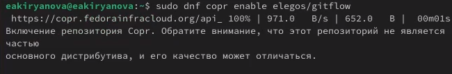{#fig:001 width=70%}

Ввожу команду dnf install gitflow (рис. [-@fig:002]).

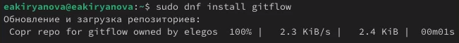{#fig:002 width=70%}

Ввожу команду dnf install nodejs (рис. [-@fig:003]).

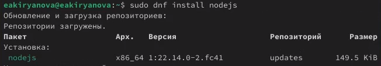{#fig:003 width=70%}

Ввожу команду dnf install pnpm (рис. [-@fig:004]).

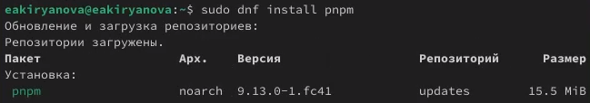{#fig:004 width=70%}

Запускаю pnpm setup (рис. [-@fig:005]).

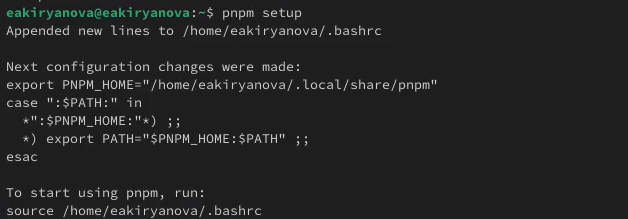{#fig:005 width=70%}

Выполняю source ~/.bashrc (рис. [-@fig:006]).

{#fig:006 width=70%}

Команда для программы, которая используется для помощи в форматировании коммитов (рис. [-@fig:007]).

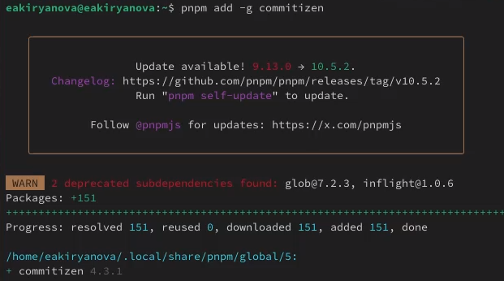{#fig:007 width=70%}

Устанавливаю скрипт (рис. [-@fig:008]).

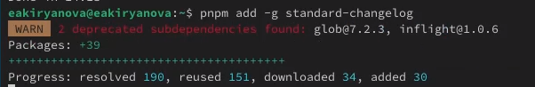{#fig:008 width=70%}

Делаю первый коммит и выкладываю на GitHub (рис. [-@fig:009]).

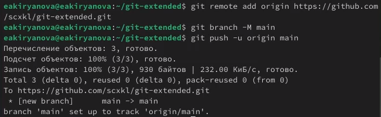{#fig:009 width=70%}

Провожу конфигурацию для пакетов Node.js (рис. [-@fig:010]).

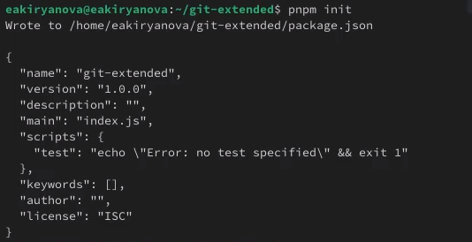{#fig:010 width=70%}

Добавляю в файл команду для коммитов (рис. [-@fig:011]).

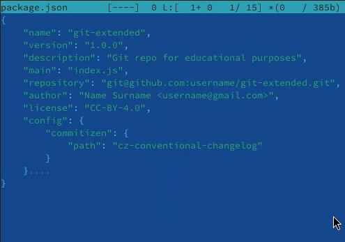{#fig:011 width=70%}

Добавляю новые файлы и выполняю коммит (рис. [-@fig:012]).

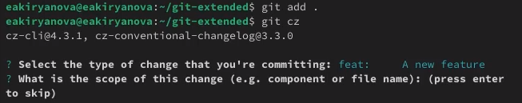{#fig:012 width=70%}

Отправляю на GitHub (рис. [-@fig:013]).

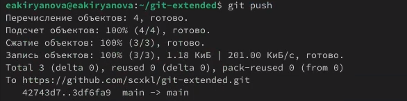{#fig:013 width=70%}

Инициализирую git-flow (рис. [-@fig:014]).

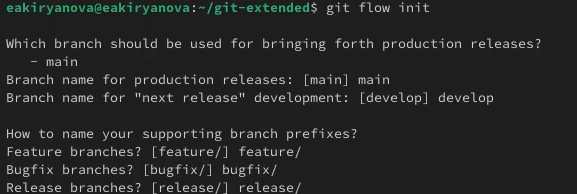{#fig:014 width=70%}

Проверяю ветку (рис. [-@fig:015]).

{#fig:015 width=70%}

Загружаю весь репозиторий в хранилище (рис. [-@fig:016]).

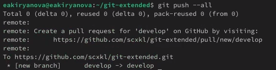{#fig:016 width=70%}

Создаю релиз с версией 1.0.0 (рис. [-@fig:017]).

{#fig:017 width=70%}

Создаю журнал изменений (рис. [-@fig:010]).

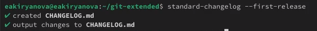{#fig:018 width=70%}

Добавляю журнал изменений в индекс (рис. [-@fig:019]).

{#fig:019 width=70%}

Отправляю данные на GitHub (рис. [-@fig:020]).

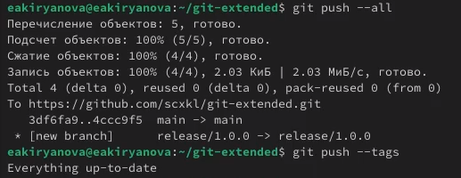{#fig:020 width=70%}

Создаю релиз на github (рис. [-@fig:021]).

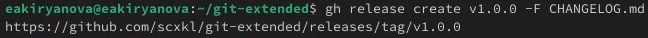{#fig:021 width=70%}

Создаю ветку для новой функциональности (рис. [-@fig:022]).

{#fig:022 width=70%}

Объединяю ветку feature_branch с develop (рис. [-@fig:024]).

{#fig:024 width=70%}

Создаю релиз с версией 1.2.3 (рис. [-@fig:025]).

{#fig:025 width=70%}

Заливаю релизную ветку в основную и отправляю данные на GitHub (рис. [-@fig:026]).

{#fig:026 width=70%}

# Выводы

В ходе выполнения данной лабораторной работы я получила навыки правильной работы с репозиториями git.

# Список литературы{.unnumbered}

1.[Операционные системы](https://esystem.rudn.ru/mod/page/view.php?id=1224234#org6da4c6b)
