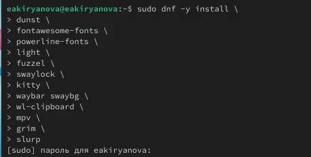
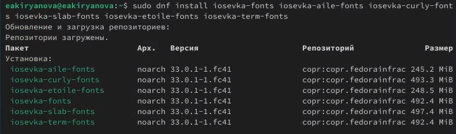

---
## Front matter
title: "Отчет по лабораторной работе №5"
subtitle: "Дисциплина: Операционные системы"
author: "Кирьянова Екатерина Андреевна"

## Generic otions
lang: ru-RU
toc-title: "Содержание"

## Bibliography
bibliography: bib/cite.bib
csl: pandoc/csl/gost-r-7-0-5-2008-numeric.csl

## Pdf output format
toc: true # Table of contents
toc-depth: 2
lof: true # List of figures
fontsize: 12pt
linestretch: 1.5
papersize: a4
documentclass: scrreprt
## I18n polyglossia
polyglossia-lang:
  name: russian
  options:
	- spelling=modern
	- babelshorthands=true
polyglossia-otherlangs:
  name: english
## I18n babel
babel-lang: russian
babel-otherlangs: english
## Fonts
mainfont: IBM Plex Serif
romanfont: IBM Plex Serif
sansfont: IBM Plex Sans
monofont: IBM Plex Mono
mathfont: STIX Two Math
mainfontoptions: Ligatures=Common,Ligatures=TeX,Scale=0.94
romanfontoptions: Ligatures=Common,Ligatures=TeX,Scale=0.94
sansfontoptions: Ligatures=Common,Ligatures=TeX,Scale=MatchLowercase,Scale=0.94
monofontoptions: Scale=MatchLowercase,Scale=0.94,FakeStretch=0.9
mathfontoptions:
## Biblatex
biblatex: true
biblio-style: "gost-numeric"
biblatexoptions:
  - parentracker=true
  - backend=biber
  - hyperref=auto
  - language=auto
  - autolang=other*
  - citestyle=gost-numeric
## Pandoc-crossref LaTeX customization
figureTitle: "Рис."
tableTitle: "Таблица"
listingTitle: "Листинг"
lofTitle: "Список иллюстраций"
lolTitle: "Листинги"
## Misc options
indent: true
header-includes:
  - \usepackage{indentfirst}
  - \usepackage{float} # keep figures where there are in the text
  - \floatplacement{figure}{H} # keep figures where there are in the text
---

# Цель работы

Получение навыков работы с менеджером паролей pass и конфигурацией chezmoi

# Задание

1. Установить и настроить менеджер паролей pass
2. Установить и подключить конфигурацию chezmoi

# Теоретическое введение

Менеджер паролей pass

Менеджер паролей pass — программа, сделанная в рамках идеологии Unix.
Также носит название стандартного менеджера паролей для Unix (The standard Unix password manager).

Основные свойства

Данные хранятся в файловой системе в виде каталогов и файлов.
Файлы шифруются с помощью GPG-ключа.

Структура базы паролей

Структура базы может быть произвольной, если Вы собираетесь использовать её напрямую, без промежуточного программного обеспечения. Тогда семантику структуры базы данных Вы держите в своей голове.
Если же необходимо использовать дополнительное программное обеспечение, необходимо семантику заложить в структуру базы паролей.

# Выполнение лабораторной работы

Устанавливаю pass (рис. [-@fig:001]).

{#fig:001 width=70%}

Устанавливаю gopass (рис. [-@fig:002]).

{#fig:002 width=70%}

Просматриваю список ключей (рис. [-@fig:003]).

{#fig:003 width=70%}

Инициализирую хранилище (рис. [-@fig:004]).

{#fig:004 width=70%}

Устанавливаю плагин browserpass (рис. [-@fig:005]).

{#fig:005 width=70%}

Устанавливаю на Fedora (рис. [-@fig:006]).

{#fig:006 width=70%}

Завершаю установку (рис. [-@fig:007]).

{#fig:007 width=70%}

Добавляю новый пароль (рис. [-@fig:008]).

{#fig:008 width=70%}

Отображаю пароль (рис. [-@fig:009]).

{#fig:009 width=70%}

Устанавливаю дополнительное программное обеспечение (рис. [-@fig:010]).

{#fig:010 width=70%}

Устанавливаю шрифты(рис. [-@fig:011]).

{#fig:011 width=70%}

Устанавливаю шрифты (рис. [-@fig:012]).

{#fig:012 width=70%}

Устанавливаю шрифты (рис. [-@fig:013]).

{#fig:013 width=70%}

Устанавливаю бинарный файл (рис. [-@fig:014]).

{#fig:014 width=70%}

Создаю свой репозиторий для конфигурационных файлов (рис. [-@fig:015]).

{#fig:015 width=70%}

Инициализирую chezmoi со своим репозиторием (рис. [-@fig:016]).

{#fig:016 width=70%}

Проверяю какие изменения вносит chezmoi (рис. [-@fig:017]).

{#fig:017 width=70%}

Получаю последние изменения (рис. [-@fig:010]).

{#fig:018 width=70%}

Устанавливаю свои dotfiles на компьютер с помощью одной команды (рис. [-@fig:019]).

{#fig:019 width=70%}

Извлекаю изменения (рис. [-@fig:020]).

{#fig:020 width=70%}

Выполняю команду (рис. [-@fig:021]).

{#fig:021 width=70%}

Функция автоматического фиксирования и отправки изменений в исходный каталог включена по умолчанию (рис. [-@fig:022]).

{#fig:022 width=70%}

# Выводы

В ходе выполнения данной лабораторной работы я получила навыки работы с менеджером паролей pass и конфигурацией chezmoi

# Список литературы{.unnumbered}

1.[Операционные системы](https://esystem.rudn.ru/mod/page/view.php?id=1224236#orgb439dd4)
