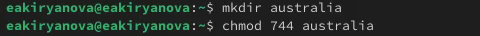

---
## Front matter
title: "Отчет по лабораторной работе №7"
subtitle: "Дисциплина: Операционные системы"
author: "Кирьянова Екатерина Андреевна"

## Generic otions
lang: ru-RU
toc-title: "Содержание"

## Bibliography
bibliography: bib/cite.bib
csl: pandoc/csl/gost-r-7-0-5-2008-numeric.csl

## Pdf output format
toc: true # Table of contents
toc-depth: 2
lof: true # List of figures
fontsize: 12pt
linestretch: 1.5
papersize: a4
documentclass: scrreprt
## I18n polyglossia
polyglossia-lang:
  name: russian
  options:
	- spelling=modern
	- babelshorthands=true
polyglossia-otherlangs:
  name: english
## I18n babel
babel-lang: russian
babel-otherlangs: english
## Fonts
mainfont: IBM Plex Serif
romanfont: IBM Plex Serif
sansfont: IBM Plex Sans
monofont: IBM Plex Mono
mathfont: STIX Two Math
mainfontoptions: Ligatures=Common,Ligatures=TeX,Scale=0.94
romanfontoptions: Ligatures=Common,Ligatures=TeX,Scale=0.94
sansfontoptions: Ligatures=Common,Ligatures=TeX,Scale=MatchLowercase,Scale=0.94
monofontoptions: Scale=MatchLowercase,Scale=0.94,FakeStretch=0.9
mathfontoptions:
## Biblatex
biblatex: true
biblio-style: "gost-numeric"
biblatexoptions:
  - parentracker=true
  - backend=biber
  - hyperref=auto
  - language=auto
  - autolang=other*
  - citestyle=gost-numeric
## Pandoc-crossref LaTeX customization
figureTitle: "Рис."
tableTitle: "Таблица"
listingTitle: "Листинг"
lofTitle: "Список иллюстраций"
lolTitle: "Листинги"
## Misc options
indent: true
header-includes:
  - \usepackage{indentfirst}
  - \usepackage{float} # keep figures where there are in the text
  - \floatplacement{figure}{H} # keep figures where there are in the text
---

# Цель работы

Ознакомление с файловой системой Linux, её структурой, именами и содержанием каталогов. Приобретение практических навыков по применению команд для работы с файлами и каталогами, по управлению процессами (и работами), по проверке использования диска и обслуживанию файловой системы
 
# Задание

1. Выполнить примеры
2. Работа с файлами
3. Изменение прав доступа
4. Работа с файлами и правами доступа
5. Изучение команд с помощью man

# Теоретическое введение

Для создания текстового файла можно использовать команду touch.
Для просмотра файлов небольшого размера можно использовать команду cat.
Для просмотра файлов постранично удобнее использовать команду less.
Команда cp используется для копирования файлов и каталогов.
Команды mv и mvdir предназначены для перемещения и переименования файлов
и каталогов.
Каждый файл или каталог имеет права доступа (табл. 5.1).
В сведениях о файле или каталоге указываются:
– тип файла (символ (-) обозначает файл, а символ (d) — каталог);
– права для владельца файла (r — разрешено чтение, w — разрешена запись, x — разре-
шено выполнение, - — право доступа отсутствует);
– права для членов группы (r — разрешено чтение, w — разрешена запись, x — разрешено
выполнение, - — право доступа отсутствует);
– права для всех остальных (r — разрешено чтение, w — разрешена запись, x — разрешено
выполнение, - — право доступа отсутствует).
Права доступа к файлу или каталогу можно изменить, воспользовавшись командой
chmod. Сделать это может владелец файла (или каталога) или пользователь с правами
администратора.
Файловая система в Linux состоит из фалов и каталогов. Каждому физическому носи-
телю соответствует своя файловая система.
Существует несколько типов файловых систем. Перечислим наиболее часто встречаю-
щиеся типы:
– ext2fs (second extended filesystem);
– ext2fs (third extended file system);
– ext4 (fourth extended file system);
– ReiserFS;
– xfs;
– fat (file allocation table);
– ntfs (new technology file system).
В данном случае указаны имена устройств, названия соответствующих им точек мон-
тирования (путь), тип файловой системы и параметрами монтирования.
В контексте команды mount устройство — специальный файл устройства, с помощью
которого операционная система получает доступ к аппаратному устройству. Файлы
устройств обычно располагаются в каталоге /dev, имеют сокращённые имена (например,
sdaN, sdbN или hdaN, hdbN, где N — порядковый номер устройства, sd — устройства SCSI,
hd — устройства MFM/IDE).
Точка монтирования — каталог (путь к каталогу), к которому присоединяются файлы
устройств.
ля определения объёма свободного пространства на файловой системе можно вос-
пользоваться командой df, которая выведет на экран список всех файловых систем
в соответствии с именами устройств, с указанием размера и точки монтирования.

# Выполнение лабораторной работы

## Выполнение примеров из первой части описания лабораторной работы

Копирую файл в текущем каталоге (рис. [-@fig:001]).

{#fig:001 width=70%}

Копирую несколько файлов в каталог (рис. [-@fig:002]).

{#fig:002 width=70%}

Копирую файлы в произвольном каталоге (рис. [-@fig:003]).

{#fig:003 width=70%}

Копирую каталоги в текущем каталоге (рис. [-@fig:004]).

{#fig:004 width=70%}

Копирую каталогов в произвольном каталоге (рис. [-@fig:005]).

{#fig:005 width=70%}

Переименование файлов в текущем каталоге (рис. [-@fig:006]).

{#fig:006 width=70%}

Перемещаю файлы в другой каталог (рис. [-@fig:007]).

{#fig:007 width=70%}

Переименование каталогов в текущем каталоге (рис. [-@fig:008]).

{#fig:008 width=70%}

Перемещаю каталог в другой каталог (рис. [-@fig:009]).

{#fig:009 width=70%}

Переименование каталога, не являющегося текущим (рис. [-@fig:010]).

{#fig:010 width=70%}

Создаю файл с правом выполнения для владельца (рис. [-@fig:011]).

{#fig:011 width=70%}

Лишаю владельца права на выполнение (рис. [-@fig:012]).

{#fig:012 width=70%}

Создаю каталог с запретом на чтение для членов группы и всех остальных пользователей (рис. [-@fig:013]).

{#fig:013 width=70%}

Создаю файл с правом записи для членов группы (рис. [-@fig:014]).

{#fig:014 width=70%}

## Работа с файлами

Копирую файл в домашний каталог и называю его equipment (рис. [-@fig:015]).

{#fig:015 width=70%}

Создаю директорию (рис. [-@fig:016]).

{#fig:016 width=70%}

Перемещаю файл equipment в каталог ski.plases (рис. [-@fig:017]).

{#fig:017 width=70%}

Переименовываю файл (рис. [-@fig:010]).

{#fig:018 width=70%}

Создаю в домашнем каталоге файл и копирую его в каталог (рис. [-@fig:019]).

{#fig:019 width=70%}

Создаю каталог (рис. [-@fig:020]).

{#fig:020 width=70%}

Перемещаю файлы в каталог (рис. [-@fig:021]).

{#fig:021 width=70%}

Создаю, перемещаю каталог и называю его plans (рис. [-@fig:022]).

{#fig:022 width=70%}

## Изменение прав доступа

Владелец имеет полный доступ, группа имеет право на чтение, остальные имеют право на чтение (рис. [-@fig:023]).

{#fig:023 width=70%}

Владелец имеет полный доступ, группа и остальные имеют право только на выполнение (рис. [-@fig:024]).

{#fig:024 width=70%}

Владелец имеет право на чтение и выполнение, группа имеет право на чтение, остальные имеют право на чтение (рис. [-@fig:025]).

{#fig:025 width=70%}

Владелец и группа имеют право на чтение и запись, остальные имеют право на чтение (рис. [-@fig:026]).

{#fig:026 width=70%}

## Работа с файлами и правами доступа

Просматриваю содержимое файла с помощью cat (рис. [-@fig:027]).

{#fig:027 width=70%}

Копирую файл (рис. [-@fig:028]).

{#fig:028 width=70%}

Перемещаю файл (рис. [-@fig:029]).

{#fig:029 width=70%}

Копирую каталог в каталог (рис. [-@fig:030]).

{#fig:030 width=70%}

Перемещаю каталога в каталог и называю его games (рис. [-@fig:031]).

{#fig:031 width=70%}

Лишаю владельца права на чтение. При попытке просмотреть файл выйдет ошибка. Копирование пройдет успешно, так как для него не требуется право на чтение исходного файла (рис. [-@fig:032]).

{#fig:032 width=70%}

Даю владельцу файла право на чтение (рис. [-@fig:033]).

{#fig:033 width=70%}

Лишаю владельца каталога права на выполнение (рис. [-@fig:034]).

{#fig:034 width=70%}

При переходе в каталог выдало ошибку (рис. [-@fig:035]).

{#fig:035 width=70%}

Даю владельцу каталога право на выполнение (рис. [-@fig:036]).

{#fig:036 width=70%}

## Изучение команд с помощью man

Команда mount используется для подключения файловых систем к дереву каталогов. Она позволяет монтировать устройства и разделы, чтобы получить доступ к их содержимому (рис. [-@fig:037]).

{#fig:037 width=70%}

Команда fsck проверяет и восстанавливает целостность файловых систем. Она используется для обнаружения и исправления ошибок на файловых системах (рис. [-@fig:038]).

{#fig:038 width=70%}

Команда mkfs используется для создания файловой системы на разделе или устройстве. Эта команда форматирует устройство, подготавливая его для хранения данных (рис. [-@fig:039]).

{#fig:039 width=70%}

Команда kill используется для отправки сигналов процессам. Наиболее часто используется для завершения процессов, но также может использоваться для отправки других сигналов (рис. [-@fig:040]).

{#fig:040 width=70%}

# Выводы

В ходе выполнения данной лабораторной работы я oзнакомилась с файловой системой Linux, её структурой, именами и содержанием каталогов. Приобрела практические навыки по применению команд для работы с файлами и каталогами, по управлению процессами (и работами), по проверке использования диска и обслуживанию файловой системы

# Список литературы{.unnumbered}

1.[Операционные системы](https://esystem.rudn.ru/pluginfile.php/2586720/mod_resource/content/4/005-lab_files.pdf)
