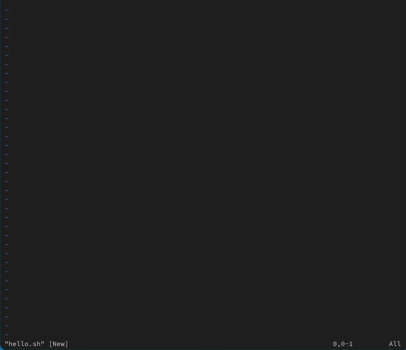
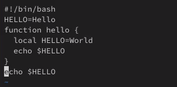

---
## Front matter
title: "Отчет по лабораторной работе №10"
subtitle: "Дисциплина: Операционные системы"
author: "Кирьянова Екатерина Андреевна"

## Generic otions
lang: ru-RU
toc-title: "Содержание"

## Bibliography
bibliography: bib/cite.bib
csl: pandoc/csl/gost-r-7-0-5-2008-numeric.csl

## Pdf output format
toc: true # Table of contents
toc-depth: 2
lof: true # List of figures
fontsize: 12pt
linestretch: 1.5
papersize: a4
documentclass: scrreprt
## I18n polyglossia
polyglossia-lang:
  name: russian
  options:
	- spelling=modern
	- babelshorthands=true
polyglossia-otherlangs:
  name: english
## I18n babel
babel-lang: russian
babel-otherlangs: english
## Fonts
mainfont: IBM Plex Serif
romanfont: IBM Plex Serif
sansfont: IBM Plex Sans
monofont: IBM Plex Mono
mathfont: STIX Two Math
mainfontoptions: Ligatures=Common,Ligatures=TeX,Scale=0.94
romanfontoptions: Ligatures=Common,Ligatures=TeX,Scale=0.94
sansfontoptions: Ligatures=Common,Ligatures=TeX,Scale=MatchLowercase,Scale=0.94
monofontoptions: Scale=MatchLowercase,Scale=0.94,FakeStretch=0.9
mathfontoptions:
## Biblatex
biblatex: true
biblio-style: "gost-numeric"
biblatexoptions:
  - parentracker=true
  - backend=biber
  - hyperref=auto
  - language=auto
  - autolang=other*
  - citestyle=gost-numeric
## Pandoc-crossref LaTeX customization
figureTitle: "Рис."
tableTitle: "Таблица"
listingTitle: "Листинг"
lofTitle: "Список иллюстраций"
lolTitle: "Листинги"
## Misc options
indent: true
header-includes:
  - \usepackage{indentfirst}
  - \usepackage{float} # keep figures where there are in the text
  - \floatplacement{figure}{H} # keep figures where there are in the text
---

# Цель работы

Познакомиться с операционной системой Linux. Получить практические навыки работы с редактором vi, установленным по умолчанию практически во всех дистрибутивах

# Задание

1. Ознакомиться с теоретическим материалом
2. Ознакомиться с редактором vi
3. Выполнить упражнения, используя команды vi 

# Теоретическое введение

В любой момент при работе в редакторе vi вы находитесь в одном из трёх режимов редактора: командный режим (command mode), режим ввода (insert mode) и режим последней строки (last line mode).

При запуске редактора vi вы оказываетесь в командном режиме. В этом режиме можно давать команды для редактирования файлов или перейти в другой режим. Например, вводя x в командном режиме мы удаляем символ, на который указывает курсор. Клавиши-стрелки перемещают курсор по редактируемому файлу. Как правило, команды, используемые в командном режиме, состоят из одного или двух символов.

Основной ввод и редактирование текста осуществляется в режиме ввода. При использовании редактора vi основное время, скорее всего, будет проводиться именно в этом режиме. Переход в режим ввода из командного режима осуществляется командой i (от слова insert). Находясь в режиме ввода, можно вводить текст в то место, куда указывает курсор. Выход из режима ввода в командный режим осуществляется клавишей Esc.

Режим последней строки═ — это специальный режим, в котором редактору даются сложные команды. При вводе этих команд они отображаются в последней строке экрана (отсюда пошло название режима). Например, если ввести в командном режиме команду :, то осуществится переход в режим последней строки, и можно будет вводить такие команды, как wq (записать файл и покинуть редактор vi) или q! (выйти из редактора vi без сохранения изменений). В режиме последней строки обычно вводятся команды, название которых состоит из нескольких символов. В этом режиме в последнюю строку вводится команда, после чего нажимается клавиша Enter, и команда исполняется.

# Выполнение лабораторной работы

Создаю каталог с именем ~/work/os/lab10 (рис. [-@fig:001]).

{#fig:001 width=70%}

Перехожу в созданный каталог (рис. [-@fig:002]).

{#fig:002 width=70%}

Вызываю vi и создаю файл hello.sh (рис. [-@fig:003]).

{#fig:003 width=70%}

Нажимаю клавишу i и ввожу следующий текст (рис. [-@fig:004]).

{#fig:004 width=70%}

Нажимаю : и ввожу wq для сохранения текста и завершения работы (рис. [-@fig:005]).

{#fig:005 width=70%}

Делаю файл исполняемым (рис. [-@fig:006]).

{#fig:006 width=70%}

Вызываю vi на редактирование файла (рис. [-@fig:007]).

{#fig:007 width=70%}

Меняю HELL на HELLO (рис. [-@fig:008]).

{#fig:008 width=70%}

Меняю LOCAL на local (рис. [-@fig:009]).

{#fig:009 width=70%}

Вставляю в последнюю строку другой текст (рис. [-@fig:010]).

{#fig:010 width=70%}

Удаляю последнюю строку с помощью команды (рис. [-@fig:011]).

{#fig:011 width=70%}

Отменяю последнюю команду (рис. [-@fig:012]).

{#fig:012 width=70%}

Сохраняю и выхожу (рис. [-@fig:013]).

{#fig:013 width=70%}

# Выводы

В ходе выполнения данной лабораторной работы я познакомилась с операционной системой Linux, получила практические навыки работы с редактором vi, установленным по умолчанию практически во всех дистрибутивах

# Список литературы{.unnumbered}

1.[Документация ALT Linux](https://docs.altlinux.org/ru-RU/archive/2.3/html-single/junior/alt-docs-extras-linuxnovice/ch02s10.html)
